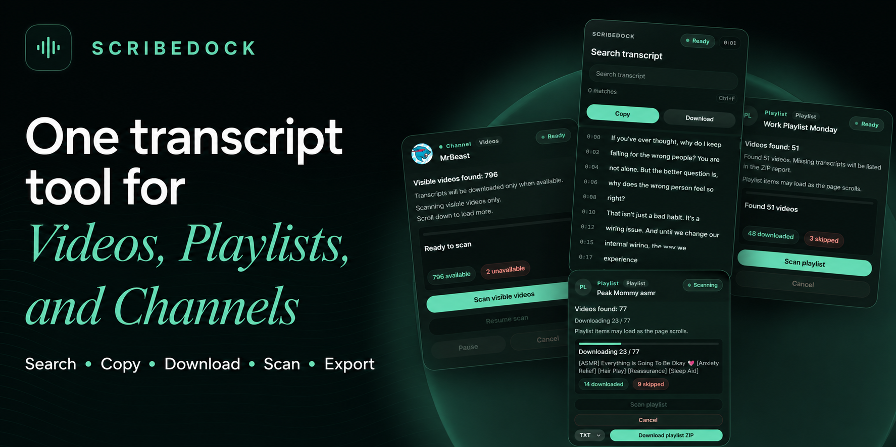

# ScribeDock



<p align="center">
  <a href="https://chromewebstore.google.com/detail/aeijmgbldnhcpnicedoebgknogfocflh?utm_source=item-share-cb">
    
  </a>
</p>

ScribeDock adds a clean Chrome side panel for reading, searching, copying, and exporting YouTube transcripts.

It is built as a Manifest V3 Chrome extension with plain JavaScript, HTML, and CSS. The extension runs on supported YouTube pages, keeps transcript work local in the browser, and packages cleanly for Chrome Web Store submission.

## Features

- View available transcripts in a dedicated Chrome side panel
- Search transcript rows while watching a video
- Copy transcript text to the clipboard
- Export transcripts as TXT, Markdown, or JSON
- Scan supported playlist and channel pages for transcript export workflows
- Handle YouTube single-page navigation without stale transcript rows
- Support YouTube video pages, Shorts, playlists, and channel tabs when transcript data is available
- Package only extension release files for Chrome Web Store upload

## Screenshots

The preview image above shows the ScribeDock transcript workspace for videos, playlists, and channels.

## Quick Install In Chrome

Use these steps to load the extension locally:

1. Open `chrome://extensions`.
2. Enable Developer Mode.
3. Click "Load unpacked".
4. Select this project folder.
5. Open a supported YouTube page and click the ScribeDock extension button.

For release testing, run the package command, unzip the generated ZIP from `dist/` into a temporary folder, and load that unpacked folder in Chrome.

## Development Setup

This project does not require a build step for local development. Chrome reads the extension source directly from `manifest.json` and `src/`.

```bash
npm test
```

Main project folders:

- `src/` - extension source files
- `tests/` - automated Node.js tests
- `scripts/` - packaging utilities
- `assets/` - source artwork and project assets

## Testing

Run the automated test suite:

```bash
npm test
```

The tests cover URL detection, transcript parsing, export formatting, package safety, manifest permissions, runtime messaging, and side panel behavior.

For browser testing, use the checklist in [QA_CHECKLIST.md](QA_CHECKLIST.md). Additional test notes are in [TESTING.md](TESTING.md).

## Build And Package

Create a Chrome Web Store ZIP:

```bash
npm run package
```

The package script writes `dist/scribedock-1.0.0.zip` and includes only:

- `manifest.json`
- `src/`

Generated ZIP files are release artifacts. They stay out of Git so the repository remains focused on source code, tests, and documentation.

## Privacy

ScribeDock is designed to work locally in your browser. It reads transcript and page data from supported YouTube pages so it can display, search, copy, and export that information for you.

ScribeDock does not send transcript text to a ScribeDock server. Exported files are created locally through the browser. Do not commit API keys, tokens, passwords, `.env` files, private notes, or packaged release ZIP files to this repository.

## Chrome Web Store

Use the ZIP from `npm run package` for Chrome Web Store submission. Before publishing:

1. Run `npm test`.
2. Run `npm run package`.
3. Unzip the generated ZIP into a temporary folder.
4. Load the unpacked folder from `chrome://extensions`.
5. Verify transcript loading, search, copy, and export on supported YouTube pages.

## Documentation

- [TESTING.md](TESTING.md) - automated and manual test instructions
- [QA_CHECKLIST.md](QA_CHECKLIST.md) - release-oriented browser QA checklist
- [KNOWN_LIMITATIONS.md](KNOWN_LIMITATIONS.md) - current product limitations
- [ROADMAP.md](ROADMAP.md) - planned polish and future improvements
- [CONTRIBUTING.md](CONTRIBUTING.md) - contribution guidelines

## Debug Mode

Enable debug logs in Chrome DevTools:

```javascript
localStorage.setItem("scribedockDebug", "true");
```

Refresh the YouTube page and look for logs starting with `[ScribeDock]`.

Turn debug logs off:

```javascript
localStorage.removeItem("scribedockDebug");
localStorage.removeItem("ytTranscriptHelperDebug");
```
